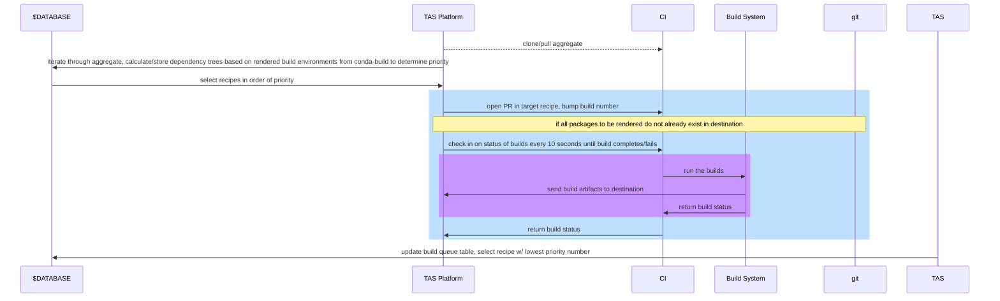

```mermaid
sequenceDiagram
    participant $DATABASE
    participant TAS Platform
    participant CI
    participant Build System
    TAS Platform-->>CI: clone/pull aggregate
    TAS Platform->>$DATABASE: iterate through aggregate, calculate/store dependency trees based on rendered build environments from conda-build to determine priority
    $DATABASE->>TAS Platform: select recipes in order of priority
    rect rgb(191, 223, 255)
    TAS Platform->>CI: open PR in target recipe, bump build number
    Note over TAS Platform,git: if all packages to be rendered do not already exist in destination
    TAS Platform->>CI: check in on status of builds every 10 seconds until build completes/fails
    rect rgb(200, 150, 255)
    CI->>Build System: run the builds
    Build System->>TAS Platform: send build artifacts to destination
    Build System->>CI: return build status
    end
    CI->>TAS Platform: return build status
    end
    TAS->>$DATABASE: update build queue table, select recipe w/ lowest priority number    
```
