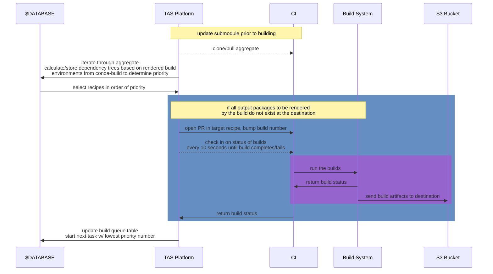

```mermaid
sequenceDiagram
    participant $DATABASE
    participant TAS Platform
    participant CI
    participant Build System
    participant S3 Bucket
    Note over TAS Platform,CI: update submodule prior to building
    TAS Platform-->>CI: clone/pull aggregate
    TAS Platform->>$DATABASE: iterate through aggregate<br/>calculate/store dependency trees based on rendered build<br/>environments from conda-build to determine priority
    $DATABASE->>TAS Platform: select recipes in order of priority
    rect rgb(101, 143, 195)
    Note over TAS Platform,Build System: if all output packages to be rendered<br/>by the build do not exist at the destination
    TAS Platform->>CI: open PR in target recipe, bump build number
    TAS Platform-->>CI: check in on status of builds<br/>every 10 seconds until build completes/fails
    rect rgb(150, 100, 205)
    CI->>Build System: run the builds
    Build System->>CI: return build status
    Build System->>S3 Bucket: send build artifacts to destination
    end
    CI->>TAS Platform: return build status
    end
    TAS Platform->>$DATABASE: update build queue table<br/>start next task w/ lowest priority number    
```
